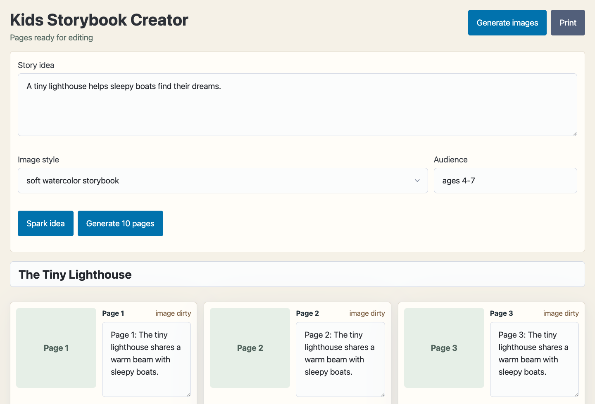
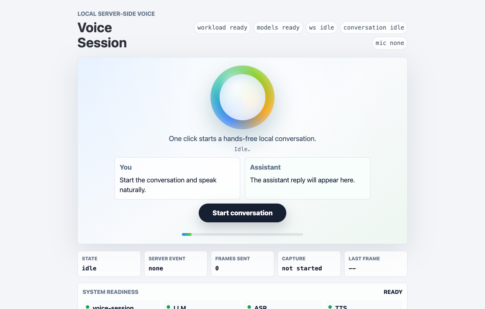

# CapaKit Apps Registry

This repository is the public registry for CapaKit AI app Kits. Each entry points to a standalone kit repository and is generated from the kit-owned metadata in `kit-meta.json`.

- Machine-readable registry: [apps.json](apps.json)
- Tag vocabulary: [TAG_ONTOLOGY.md](TAG_ONTOLOGY.md)

## Tags

`bun` 6 · `typescript` 6 · `local-ai` 5 · `llama.cpp` 4 · `mcp` 3 · `react` 3 · `vite` 3 · `web-ui` 3 · `image-generation` 2 · `oaic` 2 · `stable-diffusion` 2 · `audio` 1 · `gguf` 1 · `image-tagging` 1 · `kokoro` 1 · `speech-to-text` 1 · `starter` 1 · `text-to-speech` 1 · `transformers.js` 1 · `vision` 1 · `voice` 1 · `whisper` 1

## Featured Apps

### Kids Storybook Creator



Local-first AI app Kit for generating and editing a simple illustrated children's storybook.

`web-ui` `llama.cpp` `stable-diffusion` `image-generation` `local-ai` `react` `vite` `typescript` `bun`

Source: [https://github.com/capakit/kids-storybook-creator-demo-kit](https://github.com/capakit/kids-storybook-creator-demo-kit)

```sh
capakit run https://github.com/capakit/kids-storybook-creator-demo-kit \
--mount models=~/.capakit/models
```

### Local Image Tagger


Local AI app Kit for tagging images from a mounted folder with a local vision model.

`web-ui` `vision` `image-tagging` `llama.cpp` `mcp` `local-ai` `react` `vite` `typescript` `bun`

Source: [https://github.com/capakit/local-image-tagger-demo-kit](https://github.com/capakit/local-image-tagger-demo-kit)

```sh
capakit run https://github.com/capakit/local-image-tagger-demo-kit \
--mount images=<path-to-images> \
--mount models=~/.capakit/models
```

### Realtime Voice



Local-first AI app Kit for a browser voice conversation loop with speech recognition, local chat, and speech output.

`web-ui` `voice` `audio` `speech-to-text` `text-to-speech` `llama.cpp` `transformers.js` `whisper` `kokoro` `local-ai` `react` `vite` `typescript` `bun`

Source: [https://github.com/capakit/realtime-voice-demo-kit](https://github.com/capakit/realtime-voice-demo-kit)

```sh
capakit run https://github.com/capakit/realtime-voice-demo-kit \
--mount models=~/.capakit/models
```

## All Apps

| App | Tags | Source |
| --- | --- | --- |
| Hello World | `mcp` `starter` `typescript` `bun` | [hello-world-demo-kit](https://github.com/capakit/hello-world-demo-kit) |
| Kids Storybook Creator | `web-ui` `llama.cpp` `stable-diffusion` `image-generation` `local-ai` `react` `vite` `typescript` `bun` | [kids-storybook-creator-demo-kit](https://github.com/capakit/kids-storybook-creator-demo-kit) |
| llama.cpp Local | `llama.cpp` `gguf` `oaic` `mcp` `local-ai` `typescript` `bun` | [llama-cpp-local-kit](https://github.com/capakit/llama-cpp-local-kit) |
| Local Image Tagger | `web-ui` `vision` `image-tagging` `llama.cpp` `mcp` `local-ai` `react` `vite` `typescript` `bun` | [local-image-tagger-demo-kit](https://github.com/capakit/local-image-tagger-demo-kit) |
| Stable Diffusion Local | `stable-diffusion` `image-generation` `oaic` `local-ai` `typescript` `bun` | [stable-diffusion-local-kit](https://github.com/capakit/stable-diffusion-local-kit) |
| Realtime Voice | `web-ui` `voice` `audio` `speech-to-text` `text-to-speech` `llama.cpp` `transformers.js` `whisper` `kokoro` `local-ai` `react` `vite` `typescript` `bun` | [realtime-voice-demo-kit](https://github.com/capakit/realtime-voice-demo-kit) |
